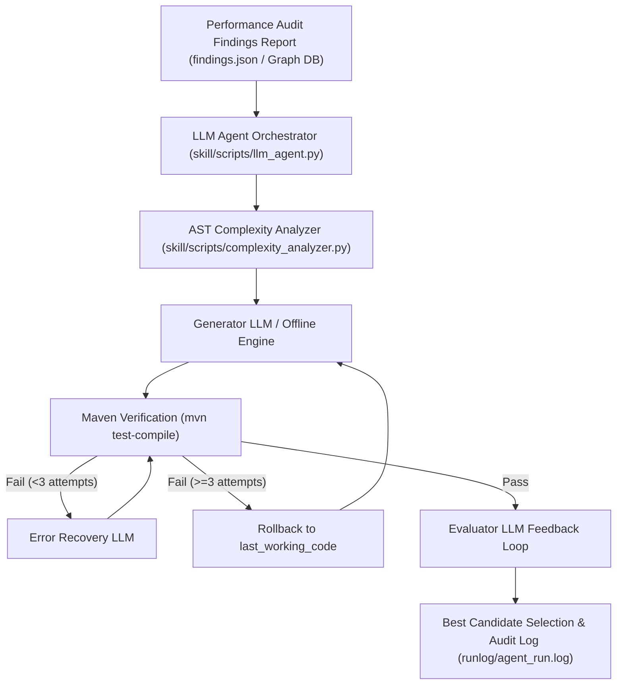

# 🤖 LLM Performance Optimization Agent Skill

An automated agent pipeline for detecting and fixing Java 21 & Spring Boot performance antipatterns based on taxonomy rules **T1–T9**.

---

## 📐 Architecture & Workflow

---

## 🛠️ Key Capabilities

1. **SysLLMatic Iterative Self-Optimization Loop (`--iterative`):**
   - Multi-agent feedback loop (Generator → Verifier → Evaluator Feedback → Best Candidate Selection).
   - AST complexity analysis for Java code ($O(N^2)$, `List.contains` in loops, string concats).
   - Automatic state rollback on 3 consecutive compilation/verification failures.
2. **Taxonomy-Aware Refactoring (T1–T9):**
   - **T1/T6 (Batching):** Replaces single `save()` loops with JDBC `saveAll()`.
   - **T2/T6 (N+1 Queries):** Replaces sub-optimal lazy loops with `JOIN FETCH` JPQL queries.
   - **T3/T4 (Projections):** Replaces heavy full-entity fetches with Spring Data JPA interface projections.
   - **T8/T3 (In-Memory Bloat):** Pushes `WHERE` filtering and `Pageable` pagination to PostgreSQL/H2 database.
3. **Section 7 Non-Defect Rules Protection:**
   - Filters out non-issues (bounded LRU caches, HotSpot field ordering, request-bounded quadratic loops).
5. **API Load Test & Micrometer Generator (`skill/scripts/generate_api_loadtests.py`):**
   - Automatically scans `@RestController` endpoints in `src/main/java`.
   - Generates executable multi-threaded API load test suites (`loadtest/api_loadtest_suite.py`).
   - Executes load tests, measures RPS and delta metrics via Micrometer (`/actuator/metrics/http.server.requests`).
   - Exports Markdown & JSON reports (`reports/sandbox/micrometer_api_report.md`).
6. **Audit Log Persistence:**
   - Records step-by-step history to `runlog/agent_run.log`.

---

## 🔌 Qwen Code Integration

This skill is also available as a native [Qwen Code](https://qwenlm.github.io/qwen-code-docs/)
subagent — see `.qwen/agents/perf-findings-agent.md` (specs
[013](../plan/013-qwen-subagent-report.md) / [014](../plan/014-qwen-subagent-fix-mode.md)). By
default it produces a read-only report from `findings.json`; it only applies code fixes if
explicitly asked.
